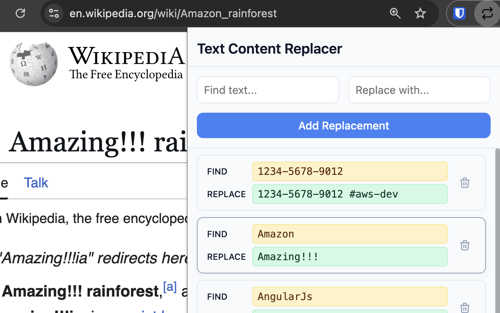

# Text Content Replacer

A Chrome extension that automatically replaces text on web pages. Perfect for adding context to identifiers, fixing common typos, or customizing your browsing experience.

## Why?

My motivation was specifically for annotating identifiers. When you regularly view dozens of identifiers it can be valuable to add valuable information, such as replacing `1234-5678-9012` with `1234-5678-9012 #aws-dev`.

## Features

- **Real-time replacement** - Changes text as pages load and update
- **Smart targeting** - Skips input fields and editable content
- **Lightweight** - No dependencies, minimal performance impact
- **Persistent storage** - Replacements sync across browser sessions

## Installation

1. Download or clone this repo
2. Open `chrome://extensions/` in Chrome
3. Enable "Developer mode" (top right)
4. Click "Load unpacked" and select the extension folder

## Usage

1. Click the extension icon to add/remove replacement records.
2. Add your find/replace pairs

## License

MIT

## Support

- Icons from: https://feathericons.com/ — [github repo](https://github.com/feathericons/feather)
