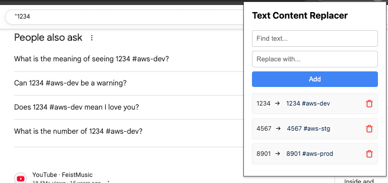

# Text Content Replacer

## Overview

Text Content Replacer is a lightweight Chrome extension that lets you swap out specific words or phrases on web pages with your custom replacements. It's simple, fast, and works in real-time as you browse.

This extension was specifically created to add additional details to various identifiers. A website may list an identifier such as `1234-5678-9012` and it would be valuable to add specifying information to these identifiers -- e.g. `1234-5678-9012 #aws-dev`

## Usage

- Click the extension icon in the Chrome toolbar to open the popup.
- Enter text to find and its replacement, then click "Add."
- Browse the web—text will be replaced automatically!

## Installation

1. Clone or download this repository.
2. Open Chrome and go to chrome://extensions/.
3. Enable "Developer mode" (top right).
4. Click "Load unpacked" and select the extension folder.
5. The extension icon will appear in your toolbar.

## Contributing

Contributions for issues or small features are welcome.

### License

MIT License. Use, modify, and share as you like.
